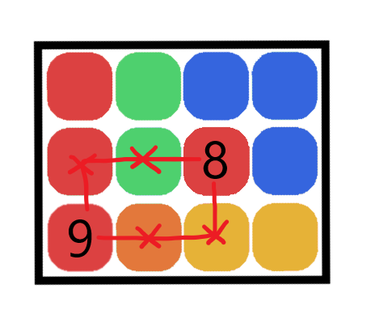
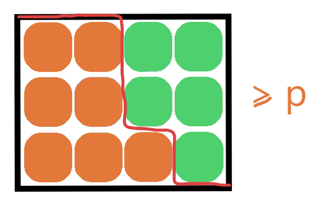

# Intro

Intro text goes here.

# Static kth largest

## Application for static kth largest

## Solution for static kth largest

### Solution 1: Sort

### Solution 2: Quick Select

# Dynamic kth largest

## Application for dynamic kth largest

Pagination of Leaderboards

## Solution for dynamic kth largest

### Solution 1: Either of the previous solutions, with append

### Solution 2.1: Balanced BST with subtree_size when k is unknown

### Solution 2.2: k-size heap when k is known

# Weighted Cubes

## Problem

Imagine we have a large $n \times m$ box of differently weighted cubes, that we balanced on one of the corners.

By shaking the box vigorously, we can ensure that for any cube, any cubes directly below it are heavier than this cube.

We'd like to find the weight of the kth heaviest cube. You're given an $n \times m$ matrix, where the bottom left corner represents the bottom corner being balanced.

## Solution

Hint 0: For this problem you might want to know some of the following programming concepts (but not necessarily all of them):

* Trees
* Binary Search
* Djikstra's Algorithm
* Heaps
* Two pointer method
* Fast prime factorisation

TODO: Add links

Hint 1: The rule about heavier cubes sinking is stated as those directly bellow must be heavy, but this implies something much more global about the array. What is it?

Hint 2: What is the heaviest cube in the array, what is the second heaviest?

Hint 3: The problem can be solved in worst case time complexity:

* $k \log_2(k)$
* $(n+m)\log_2(\max(\text{matrix}) - \min(\text{matrix}))$
* $(n+m)\log(nm)$ ??

### Solution 1: Grow from largest to kth largest with a heap

From the first hint, we know that each row and column is sorted from left to right and bottom to top. From this, there is only a single spot possible where the heaviest cube can sit - in the bottom left corner.

One thing we can intuit from this is that taking any path that only moves right and up through the matrix always decreases in weight. As such the second heaviest cube must appear directly next to the heaviest, either to the right or above.

We can continue this argument to show that the $k^{\text{th}}$ heaviest cube will always sit next to the $j^{\text{th}}$ heaviest cube for some $j < k$.

As such, we can find the $k^{\text{th}}$ heaviest cube by repeatedly finding the $i^{\text{th}}$ heaviest cubes, taking $i$ from $1$ to $k$. As we continue, we keep track of all adjacent cubes and add them to a maximum heap.

TODO: GIF

This requires $k$ removals from the heap, and at most $2k$ additions to the heap, so the total complexity is bound by

$$
    k\log_2(2k) + 2k\log_2(2k) = \mathcal{O}(k\log_2(k))
$$

TODO: Pseudocode

### Solution 2: Binary search approach

Notice that for a particular value $p$, we can find the total number of cubes heavier than $p$ kg in $\mathcal{O}(n+m)$ time, by noticing that the boundary of those greater than $p$ kg form a diagonal line through the board, which only ever moves right or down:

Therefore we can binary search on the kilogram weight of the kth largest cube, and at every iteration check the actual number of cubes heavier than $p$ kilograms.

TODO: Pseudocode

### Solution 3: Funky binary search approach

I don't know the complexity of this approach but it seems faster, given it is not reliant on the matrix value ranges, although it seems to be logarithmic with a less forgiving base.

Rather than doing a traditional binary search, we'd like to reduce our search window in two dimensions simultaneously, without restricting ourselves to a rectangular search window.
So instead, on each row and column we'll store the minimum and maximum index currently available.

When selecting a new pivot point to find the boundary of, the worst possible outcome is that all this removes from the search space are the points in the bottom right or top left of the search space.

TODO: Image

So select the square which maximises the minimum of these two areas using an additional binary search on each row/column in $\mathcal{O}(n+m)\log_2(n+m)$.

TODO: Pseudocode

I'm not sure how you'd prove that this minimum reduced search space decreases as time goes on, but initial testing makes it seem like it is bounded below by a TODO.

TODO: Image analysis graph

# Aggregate of multiple kth largest

## Application of aggregate kth largest

TODO: Explain

You've been given multiple weather vanes, which have been capturing temperature data daily, for the last century. For each of these weather vanes, you can query it, asking for the $i^{\text{th}}$ hottest day recorded by this vane (and this is the only type of query you can make) Let's say this query has complexity $\mathcal{O}(F)$, which is very large (and so you want to minimise the queries required).

You'd like to compute the $k^{\text{th}}$ hottest recording aggregated over all of the weather vanes, and which weather vane gave this recording.

TODO: Image of solution, with top-k results for all weather vanes.

## Solutions - 2 vanes

This problem gets a bit easier when only 2 weather vanes are involved.

Hint 1: The easiest solution is simply to find the top k recordings on both weather vanes, and then sort the resulting list of 2k recordings, finding the $k^{\text{th}}$ index. This solution has complexity $\mathcal{O}(k \times F + k\log_2(k))$

Hint 2: With a very similar approach to Hint 1, we can achieve $\mathcal{O}(k \times F)$ complexity.

Hint 3: Suppose that the $k^{\text{th}}$ hottest reading was the $a^{\text{th}}$ hottest reading on weather vane 1. How many readings from weather vane 2 must be hotter than the $k^{\text{th}}$ hottest reading?
Answer: $k - a$, since in total there are $k-1$ readings hotter than the $k^{\text{th}}$, and $a - 1$ of them come from weather vane 1.

TODO: Explain solution 1 - merge approach

TODO: Pseudocode

TODO: Explain solution 2 - binary search

TODO: Pseudocode

## Solutions - >2 vanes

### Solution 1 when >2 vanes: Heap moving forward

### Solution 2 when p>2 vanes: Removing 1/p each time

### Solution 3 when >2 vanes: Modified binary search
